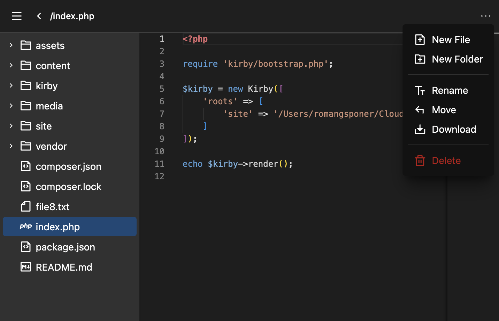

# Kirby Editor

## Overview

Kirby Editor is a fully functional built-in file explorer for Kirby CMS.

**Features**

⭐️ Easy access to the editor via the Kirby menu bar. 
⭐️ Full access to your project folder. You can also set a custom start folder. 
⭐️ Preview for several file types (Markdown, PDF, HTML, Media & Fonts). 
⭐️ A filetree field included to select files and folders from your project folder. 
⭐️ Useful features for organizing files and folders (create, delete, move, rename, download). 
⭐️ Edit text files just like you do in VSCode. 
⭐️ Prevent overwriting if the file on the server is newer. 
⭐️ Smart caching feature for fast file switching. 

**Upcoming features**

🤩 Graphical blueprint editor extension! 
⭐️ Extended permissions 
⭐️ Popup on right click

## Important security notice

Before using this plugin, please note the following: 
Changes to files or folders made with this tool may affect the functionality of Kirby.

As a first security measure, access to the editor is restricted to administrators by default. It is recommended to remove the `admin` [role](https://getkirby.com/docs/guide/users/roles) from users without technical knowledge.
Using the `plain.editor.access` option, you can define which user roles are allowed to access the editor.

⚠️ **The developer of this plugin accepts no liability for any damage or data loss.**

## Installation

**Manually**

[Download](https://github.com/plain-solutions-gmbh/kirby-editor) and copy the plugin into your plugin folder: `/site/plugins/`

**With Composer**

`composer require plain/kirby-editor`

## Options

`plain.editor.access` 
A list of roles that have access to the editor. (Default: `admin`) 

`plain.editor.root` 
A relative path to the start folder. (Default: kirby root)
`

`plain.editor.extensions` 
Redefines mime type by its file extension

`plain.editor.mimes.(mime/type)` 
An array of options for the given mime type. Wildcards allowed `text/*`
| Key        | Description                                                                                                           | Default                  |
| ---------- | --------------------------------------------------------------------------------------------------------------------- | ------------------------ |
| icon       | Icon that appears in file tree or folder preview                                                                      | \`file\` or \`folder\`   |
| component  | A preview component to open the file                                                                                  | k-editor-preview-default |
| components | Array of selectable previews.\`\['preview-component' => 'name-or-translation-key']\`                                  | (none)                   |
| language   | Sets the \[language]\(https\://github.com/microsoft/monaco-editor/tree/main/src/basic-languages) for the text editor. | `text`                   |
| options    | Props that are given to the preview component.                                                                         |                          |

## License

This plugin is free to use and is published under the MIT license. If you use this plugin for commercial purposes or wish to show your appreciation, [support me with a donation](https://www.paypal.com/donate/?hosted_button_id=YBXZWG7E6GMZQ).